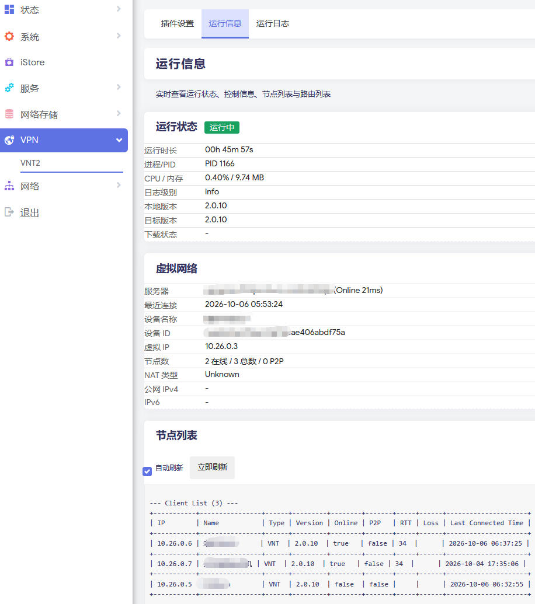
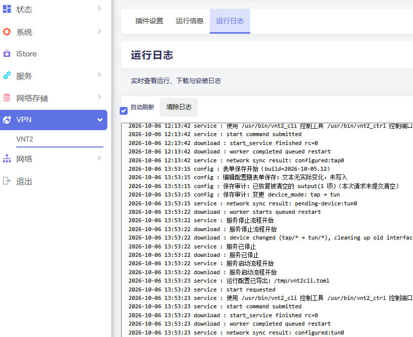

# luci-app-vnt2cli

OpenWrt LuCI 插件，用于管理 VNT2 命令行客户端 `vnt2_cli` 与控制工具 `vnt2_ctrl`。

## 功能

- 图形化配置 VNT2 客户端全部参数。
- 支持直接编辑 TOML 文本配置。
- 实时查看运行状态、节点列表与运行日志。
- 支持手动上传 `vnt2_cli` / `vnt2_ctrl` 二进制或压缩包。

## 界面截图

### 插件设置


### 运行信息



### 运行日志



## 文件说明

| 路径 | 说明 |
|------|------|
| `/etc/config/vnt2` | UCI 配置文件，唯一配置来源。 |
| `/tmp/vnt2cli.toml` | 运行时配置，由 init 脚本从 UCI 导出，每次启动重新生成，直接编辑无效。 |

## 安装

### OpenWrt 24.10.x（IPK）

系统 → 软件包 → 上传软件包，安装即可；或 SSH 执行：

```sh
opkg install /tmp/luci-app-vnt2cli_*.ipk
```

### OpenWrt 25.12.x（APK）

Release 发布的 `.apk` 由 SDK 自编译构建，未使用官方签名密钥，属于未签名包，安装和后续升级都需要 `--allow-untrusted` 参数。将 APK 上传到路由器 `/tmp/` 后通过 SSH 执行：

```sh
apk add --allow-untrusted /tmp/luci-app-vnt2cli_*.apk
```

> 注意：LuCI 软件包上传页面不会自动添加 `--allow-untrusted` 参数，APK 请通过 SSH 安装。

## 卸载

### OpenWrt 24.10.x

```sh
opkg remove luci-app-vnt2cli
```

### OpenWrt 25.12.x

```sh
apk del luci-app-vnt2cli
```

## 使用说明

1. 进入 `VPN → VNT2 → 插件设置`，勾选**启用客户端**并填写网络编号、订阅链接等参数。
2. 点击**保存并应用**，插件会自动导出配置并启动 `vnt2_cli`。
3. 切换到**运行信息**查看连接状态、虚拟 IP、节点列表。
4. 切换到**运行日志**排查启动与连接问题。
